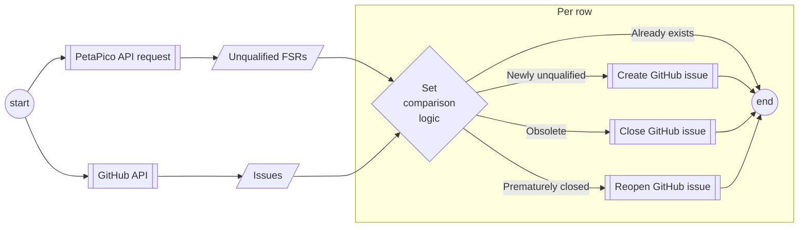

# Qualification Issue Action

[](https://github.com/super-linter/super-linter)


Use this template to bootstrap the creation of a JavaScript action. 


## Initial Setup

After you've cloned the repository to your local machine or codespace, you'll
need to perform some initial setup steps before you can develop your action.

> [!NOTE]
>
> You'll need to have a reasonably modern version of
> [Node.js](https://nodejs.org) handy. If you are using a version manager like
> [`nodenv`](https://github.com/nodenv/nodenv) or
> [`nvm`](https://github.com/nvm-sh/nvm), you can run `nodenv install` in the
> root of your repository to install the version specified in
> [`package.json`](./package.json). Otherwise, 20.x or later should work!

1. :hammer_and_wrench: Install the dependencies

   ```bash
   npm install
   ```

1. :building_construction: Package the JavaScript for distribution

   ```bash
   npm run bundle
   ```

1. :white_check_mark: Run the tests

   ```bash
   $ npm test
   
   PASS  ./index.test.js
     ✓ throws invalid number (3ms)
     ✓ wait 500 ms (504ms)
     ✓ test runs (95ms)
   
   ...
   ```

## Update the Action Metadata

The [`action.yml`](action.yml) file defines metadata about your action, such as
input(s) and output(s). For details about this file, see
[Metadata syntax for GitHub Actions](https://docs.github.com/en/actions/creating-actions/metadata-syntax-for-github-actions).

When you copy this repository, update `action.yml` with the name, description,
inputs, and outputs for your action.

## Update the Action Code

The [`src/`](./src/) directory is the heart of your action! 

For more information about the GitHub Actions toolkit, see the [documentation](https://github.com/actions/toolkit/blob/master/README.md).

So, what are you waiting for? Go ahead and start customizing your action!

1. Create a new branch

   ```bash
   git checkout -b releases/v1
   ```

1. Replace the contents of `src/` with your action code
1. Add tests to `__tests__/` for your source code
1. Format, test, and build the action

   ```bash
   npm run all
   ```

   > [!WARNING]
   >
   > This step is important! It will run [`ncc`](https://github.com/vercel/ncc)
   > to build the final JavaScript action code with all dependencies included.
   > If you do not run this step, your action will not work correctly when it is
   > used in a workflow. This step also includes the `--license` option for
   > `ncc`, which will create a license file for all of the production node
   > modules used in your project.

1. Commit your changes

   ```bash
   git add .
   git commit -m "My first action is ready!"
   ```

1. Push them to your repository

   ```bash
   git push -u origin releases/v1
   ```

1. Create a pull request and get feedback on your action
1. Merge the pull request into the `main` branch
1. Create a tag

Your action is now published! 


-----

# Process flow



